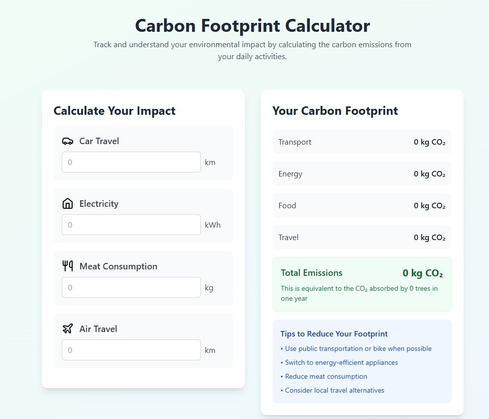

# 🌍 Carbon Footprint Calculator

This repository contains a modern, interactive **Carbon Footprint Calculator** that estimates individual CO₂ emissions based on lifestyle choices. The app is built using **React**, **Tailwind CSS**, and **Vite**, offering a fast, responsive, and clean user experience.

🌱 Designed to promote sustainability awareness by helping users understand their environmental impact.

---

## 🚀 Live Demo

👉 [Calculate Your Carbon Footprint Now](https://culate-carbon-footprint.netlify.app)

---

## 🎯 Project Objective

To provide users with a simple, intuitive tool to calculate their **annual carbon footprint**, using:

- 🏠 Household energy consumption
- 🚗 Transportation habits
- 🍽️ Diet and food choices
- 🛍️ Shopping and waste behaviors
- 🌿 Tips to reduce emissions

---

## 📦 Tech Stack

- **Frontend**: React
- **Styling**: Tailwind CSS
- **Build Tool**: Vite
- **Icons & Assets**: Lucide Icons / SVGs
- **State Management**: React state/hooks

---

## ⚙️ Features

| Feature                     | Description |
|-----------------------------|-------------|
| Household CO₂ calculator    | Energy use from electricity, gas, etc. |
| Transport emissions         | Based on weekly driving, flights, etc. |
| Food and diet footprint     | Includes meat, dairy, and local/organic factors |
| Waste & consumption impact  | Considers clothing, electronics, and waste |
| Total footprint output      | Estimated yearly CO₂ output in tons |
| Actionable tips             | Suggestions to lower emissions |
| Clean UI/UX                 | Built with Tailwind for responsiveness |
| Fast dev experience         | Vite for blazing fast HMR and build |

---

## 🧠 Calculator Logic

The calculator uses **emission factors** based on globally accepted environmental data sources (like the EPA, WWF, and UN reports). Each section (transport, energy, etc.) contributes to a final footprint total, and the app provides suggestions based on user input.

---

## 📸 Screenshots



| Input Form | Results Page |
|------------|--------------|
|  |  |

---

## 📁 Project Structure

```

📦 carbon-footprint-calculator/
┣ 📄 App.jsx
┣ 📄 main.jsx
┣ 📁 components/
┃ ┣ 📄 CalculatorForm.jsx
┃ ┣ 📄 ResultCard.jsx
┣ 📁 data/
┃ ┗ 📄 emissionFactors.js
┣ 📁 utils/
┃ ┗ 📄 calculateFootprint.js
┣ 📄 index.html
┣ 📄 tailwind.config.js
┣ 📄 vite.config.js
┣ 📁 public/
┗ 📁 assets/

````

---

## 🧑‍💻 Getting Started

1. **Clone the repository**:
```bash
git clone https://github.com/your-username/carbon-footprint-calculator.git
cd carbon-footprint-calculator
````

2. **Install dependencies**:

```bash
npm install
```

3. **Run the development server**:

```bash
npm run dev
```

4. **Build for production**:

```bash
npm run build
```

---

## 🌐 Deployment

This project is **live on Netlify**:
🔗 [https://culate-carbon-footprint.netlify.app](https://culate-carbon-footprint.netlify.app)

### Manual Deployment Steps

1. Push your code to GitHub
2. Log in to [Netlify](https://netlify.com) and create a new site from GitHub
3. Set the **build command** to:

```bash
npm run build
```

4. Set the **publish directory** to:

```bash
dist
```

---

## 📈 Upcoming Features

* [ ] Store and compare multiple footprints
* [ ] Add charts/graphs using Chart.js or Recharts
* [ ] Mobile PWA support
* [ ] Internationalization (i18n)
* [ ] Dark mode toggle

---

## 🙌 Acknowledgments

* [React](https://reactjs.org/)
* [Tailwind CSS](https://tailwindcss.com/)
* [Vite](https://vitejs.dev/)
* Emission factor references:

  * [EPA](https://www.epa.gov/ghgemissions/household-carbon-footprint-calculator)
  * [WWF Footprint](https://footprint.wwf.org.uk)
  * [UN Environment Programme](https://www.unep.org)

---

> 💬 Contributions, stars, and feedback are welcome!

```

Let me know if you want me to create sample screenshots or badges (like Netlify status, license, or GitHub stars).
```
